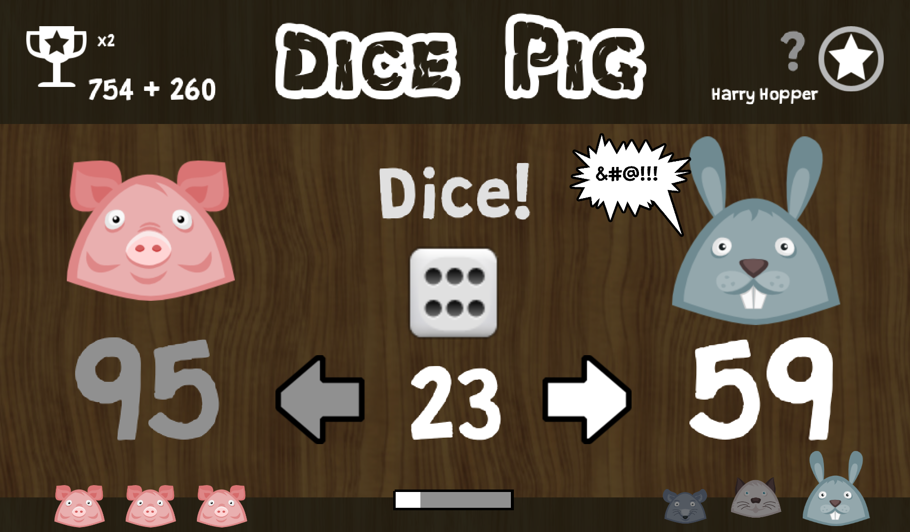
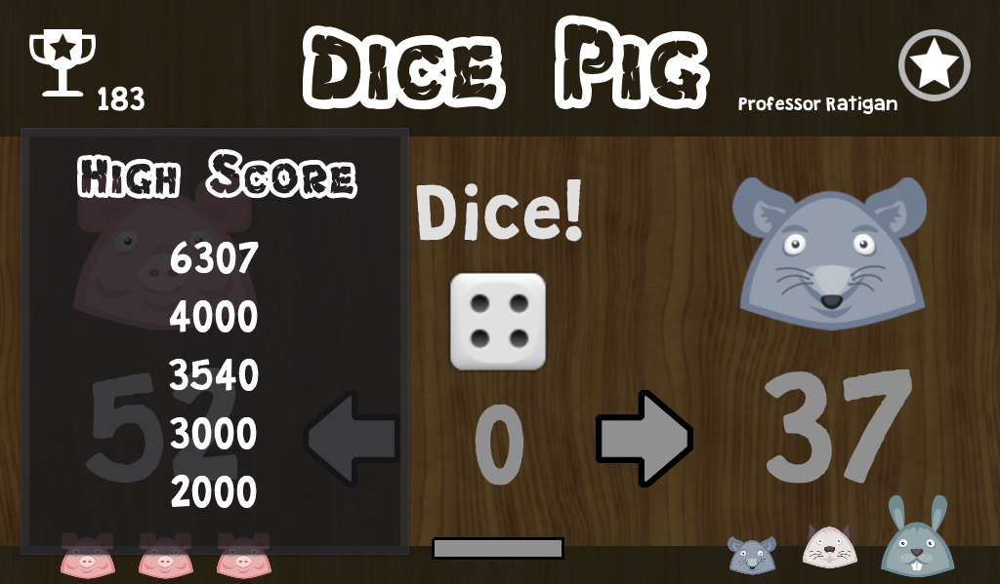
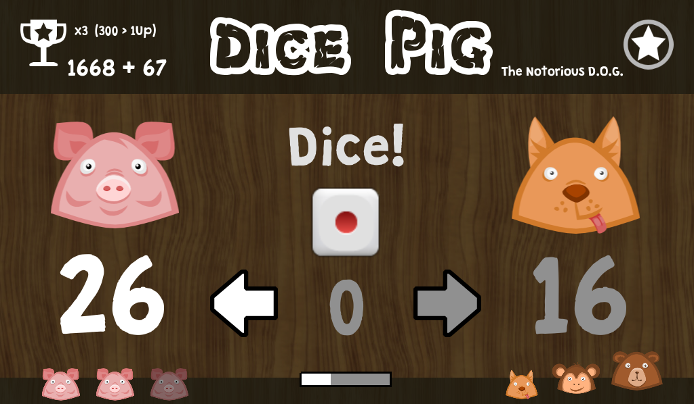
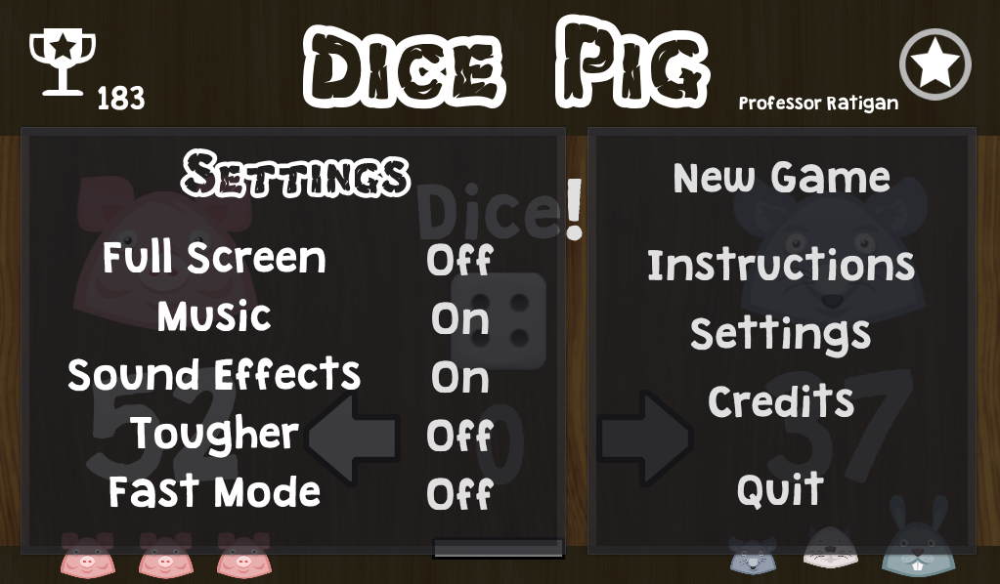

**Dice Pig** is a simple dice game made with [Godot Engine](https://godotengine.org) | Free to Play: [itch.io](https://thelavablock.itch.io/dice-pig)

Tutorial: [Making a 2D Game - UI/Mechanics/Sound](https://steemit.com/utopian-io/@thelavablock/godot-engine-tutorial-making-a-2d-game-ui-mechanics-sound)

**Dice Pig** is a deceptively simple dice game that anyone can learn in a snap:

**Step 1: Roll the die.**

If you roll a one, you lose all the points you accumulated during that turn, and you lose your turn. 

**Step 2:**

Continue rolling the die until you're happy with the number of points you've scored. Then, "hold" by handing the die over to your opponent, and track all points earned during your turn. 

**Step 3:**

Reach 100 points first and win the round. 

**Tip:**

Knowing when to stop rolling and end your turn is the key to winning this game. It's an exercise in deciding between gut instinct and greed.

You are the pig on the left and you play against 9 individual animals (rat, cat, rabbit, dog, monkey, bear, cow and two specials).  Get a high score! 

You have 3  lives.  (Get extra life by playing risky)

